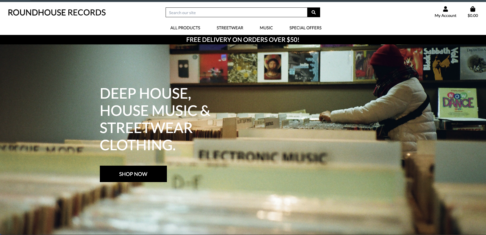
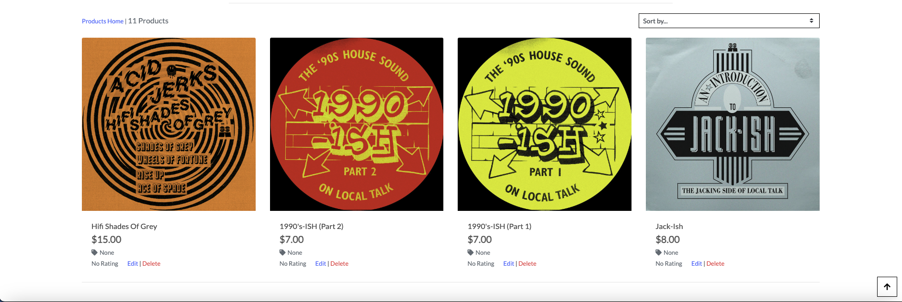
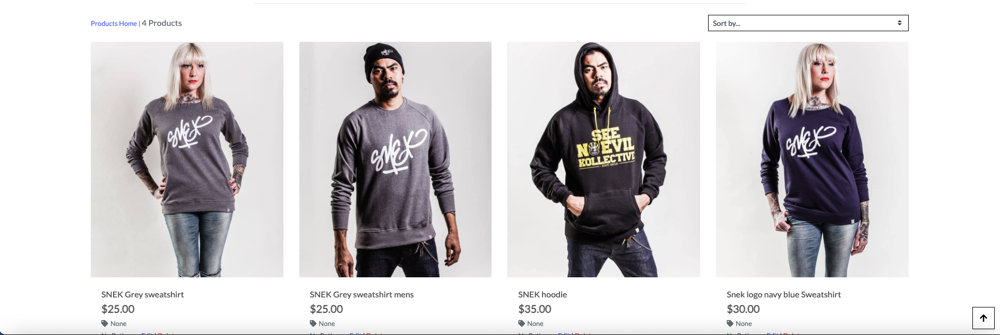

# E-commerce website Roundhouse Records

**Deployed website: [Link to website](https://roundhouse-records-29501f14b65f.herokuapp.com/)**

**Card number for payment testing: 4242424242424242**

## About

Roundhouse Records is a e-commerce website that allows customers to buy music products (vinyl) and streetwear clothing online. It has login system, a shopping cart, a checkout system, and payment system. Customers can write reviews and rate products. Also customers are able to listen to the music before purchasing through links spavined on Spotify. Customers are able to add products to their wish slit for purchase at a later date. The website allows the store owner to update and edit products and also delete products when sold out.

---

## UX

I have had a very tight time constraint with only 4 weeks to complete this project as well as follow the walk-along project, Boutique Ado. I took the decision to base the webshop on the walk-along project, Boutique Ado. I have used high-quality images of products from friends and from past projects, which I feel gives the consumer a real visualization of quality within the site and products.

### Target Audience

This website is tailored for enthusiasts of the deep house music scene, those with a passion for unique streetwear, and vinyl collectors. Our core audience ranges from individuals seeking exclusive deep house records to those wanting to express their musical tastes through fashionable streetwear. Given the niche focus on deep house, we anticipate attracting dedicated music aficionados and those looking for a blend of style and sound. With features like limited edition releases, exclusive artist collaborations, and a curated selection of vinyl, our aim is to become a staple in the daily lives of deep house enthusiasts.  In a marketplace bustling with diverse products, we've prioritized user-friendly navigation to ensure our audience can easily find and purchase their desired items.

### User Stories

| Issue ID    | User Story |
|-------------|-------------|
| [#1](https://github.com/KristianDsmith/project-5/issues/1) | As a shopper I can view all list of productsso thatselect some to purchase |

