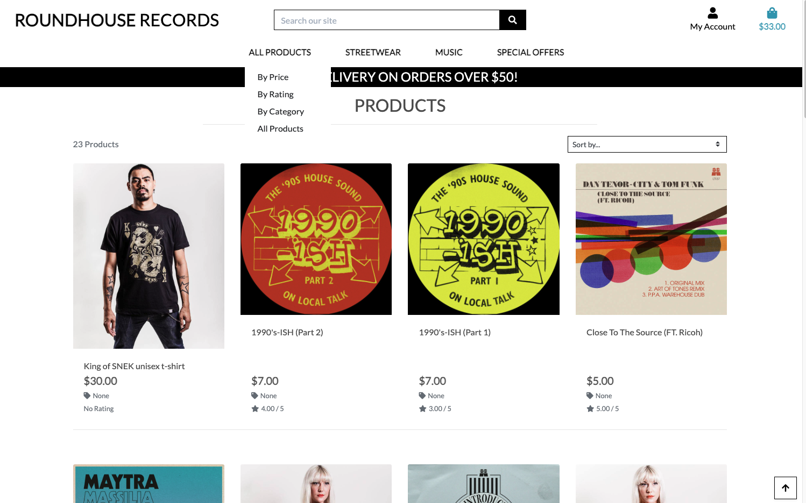

# TESTING

## Manual Testing

Testing was done throughout site development, for each feature before it was merged into the master file.

Usability was tested with the below user acceptance testing, sent to new users to ensure testing from different users, on different devices and browsers to ensure issues were caught and where possible fixed during development.

## Testing User Story

| Shopper Goals | Requirement met | Image |
| ------------------------- | --------------- | ----- |
| As a shopper I can view all list of products so that select some to purchase | Y |  |
| As a shopper I can view a specific category of products so that quickly find products i am interested in. | Y |  |
| As a shopper I can view individual product details so that identify price, description, product rating, product image, listen to sample music, available sizes | Y |  |
|As a First Time Visitor, I want to be able to find the app useful, so that I can use it according to my needs. | Y |  |
| As a First Time Visitor, I want to be informed clearly if I am making any errors when registering my account, so that I can be able to fix any errors quickly if I make some. | Y |  |
| As a First Time Visitor, I want to be able to see the list of products, so that I can learn the benefits of the app as a user. | Y |  |

| Frequent Visitor Goals    | Requirement met | Image |
| ------------------------- | --------------- | ----- |
| As a Regular User, I want to be able to access my account without having to log in every time, so that I can quickly buy a product that I need. | Y |  |
| As a Regular User, I want to be sure that my account details are protected, so that I can safely make purchases. | Y |  |
| As a Regular User, I want to be able to view my data, so that I can easily check my account details and past orders. | Y |  |
| As a Regular User, I want to be able to add, edit, and save my address data, so that I can make an order faster. | Y |  |
| As a Regular User, I want to be able to search products by category, tag, or text search, so that I can find a product faster., s a Regular User, I want to be able to sort products by category, so that I can find the best option to buy. | Y |  |
| As a Regular User, I want to be able to leave a product review, so that I can share my feedback. | Y |  |
| As a Regular Visitor, I want to be able to see ratings and reviews on a product, so that I can make a prudent decision before buying it. | Y |  |
| As a Regular User, I want to be able to see the list of products, so that I can learn the benefits of the app as a user. | Y |  |
| As a Regular Customer, I want to be able to see discount offers, so that I can buy products with a discount and save some money. | Y |  |
| As a Customer, I want to be able to see if the product is about to go out of stock, so that I can plan my purchases. | Y |  |
| As a Customer, I want to be able to see if the product is out of stock, so that I can be informed in advance that the item is not available and save my time. | Y |  |
| As a Customer, I want to be able to See a full product description (image, name, description, options, price, discount), so that I can understand whether I want to buy this product. | Y |  |
|As a Customer, I want to be able to see the product’s options (size, color, height), so that I can understand whether the option of the product suits me. | Y |  |
| As a Customer, I want to be able to choose, edit product’s options (size, color, height), so that I can choose an appropriate option of the product. | Y |  |
| As a Customer, I want to be able to ask for the notification from the shop if I want to purchase a product that is out of stock or about to finish, so that I can buy a product that I really want. | Y |  |
| As a Customer, I want to be able to get an email notification from the shop about special offers, promotions, discounts, so that I can make purchases cheaper. | Y |  |
| As a Customer, I want to be able to get an email notification from the shop if the product that I wanted and was out of stock came back to the shop, so that I can buy a product that I really want when it is available.   | Y |  |
| As a Customer, I want to be able to add product to my wish list, so that I can buy it later. | Y |   |
| As a Customer, I want to be able to remove products to my wish list, so that I can keep my wish list up to date. | Y | |
| As a Customer, I want to be able to view products on my wish list, so that I can plan my purchases. | Y |  |
| As a Customer, I want to be able to add products to my bag, so that I can easily save products in the bag. | Y |   |
| As a Customer, I want to be able to increase/reduce the number of product items in my bag that I want, so that I can buy a number of items that I want. | Y |  |
| As a Customer, I want to be able to see the counted total cost of the product, so that I can see how much I will spend. | Y |  |
| As a Customer, I want to be able to see the total cost of the products in the bag, so that I can see how much I will spend. | Y |  |
| As a Customer, I want to be able to remove the product from my bag, so that I can change my mind not to buy a particular product at the last moment. | Y |  |
| As a Customer, I want to be able to see messages from the shop, so that I can understand whether an item is actually added to the bag or removed.   | Y |  |
| As a Visitor, I want to be able to send photos of a product, so that I can provide proof if there are any probable issues with the delivered product (wrong color, size, or damage). | Y |  |
| As a Customer who made a purchase, I want to be able to review the order status, so that I can understand where my purchase is. | Y |  |
| As a Customer who made a purchase, I want to be able to see order confirmation after checkout, so that I can see what I bought. | Y |  |
| As a Customer who made a purchase, I want to be able to receive an email confirmation of my purchase, so that I can have email proof of purchase. | Y |  |
| As a Regular user, I want to be able to change my profile data, so that I can keep my profile up to date. | Y |  |
| As a Regular User, I want to be able to add, edit, and delete addresses, so that I can be sure that I will receive my order at the correct address. | Y |     |
| As a Regular User, I want to be able to change primary address, so that I can set the primary address without editing it. | Y |    |

| Manager + Admin Visitor Goals    | Requirement met | Image |
| ------------------------- | --------------- | ----- |
| As a Manager, I want to be able to add, edit, and delete category, so that I can keep products’ categories up to date. | Y |  |
| As a Manager, I want to be able to add, edit, and delete products, so that I can keep shop products up to date.  | Y |   |
| As a Manager, I want to be able to add, edit, delete tags, so that I can keep products’ sorting up to date and, as a result, increase sales.  | Y |   |
| As a Manager, I want to be able to change tags for a product, so that I can increase sales for a particular product.  | Y |  |
| As a Manager, I want to be able to Add, edit, and delete products’ options (attributes and values), so that I can keep products’ options up to date. | Y |  |
| As a Manager, I want to be able to send emails to customers about future promotions, so that I can increase sales by notifying customers about promotions. | Y |  |
| As a Manager, I want to be able to view customers' data, so that I can contact customers if needed and solve possible problems with purchases.  | Y |  |
| As a Manager, I want to be able to control product status (active/not active), so that I can keep shop stock up to date.  | Y |  |
| As a Manager, I want to be able to Review user’s requests on a product that is out of stock, so that I can understand customers' urgent needs. As a Manager, I want to be able to review user’s requests on a product that is about to go out of stock, so that I can understand customers' urgent needs and products’ popularity. | Y |  |
| As a Manager, I want to be able to send emails to customers who left notification letters about products coming back to the shop, so that I can enhance customer loyalty and increase sales.  | Y |  |
| As a Admin, I want to be able to review and edit orders’ status, so that I can control customers’ orders and sales.  | Y |  |
| As a Manager, I want to be able to sort products by stock number, so that I can control stock numbers.  | Y |  |
| As a Manager, I want to be able to review customers’ orders, so that I can control orders.  | Y |  |
| As a Manager, I want to be able to sort orders by date and status, so that I can prioritize orders.  | Y |  |
 As a Manager, I want to be able to display new products label, so that I can be sure that customers will be aware of new products in the shop.  | Y |  |
| As a Manager, I want to be able to Allow customers to leave reviews only after they receive a product, so that I can control that reviews are relevant.  | Y |  |

| Logistics Manager + Admin Visitor Goals    | Requirement met | Image |
| ------------------------- | --------------- | ----- |
| As a Logistics Manager or Admin, I want to be able to render order status, so that I can track at which stage the order is in.  | Y |  |

| Admin Visitor Goals    | Requirement met | Image |
| ------------------------- | --------------- | ----- |
| As an Admin, I want to be able to add promotions, so that I can increase sales and enhance customers’ loyalty.  | Y |   |
| As an Admin, I want to be able to get a visible notice about products that are running in stock, so that I can keep stock up to date. | Y |   |
|  As an Admin, I want to be able to be aware of units sold, so that I can be aware of sales on a particular product. | Y |  |
| As an Admin, I want to be able to get a visible notice if there is some inconsistency in sales, so that I can be aware of possible stealing.  | Y |  |
| As an Admin, I want to be able to get a visible notice if there a product is not salable, so that I can make a decision about stopping purchasing this product for my store.  | Y |  |
|  As an Admin, I want to be able to send special discounts email notifications, so that I can inform loyal customers about special offers. | Y | |

---
